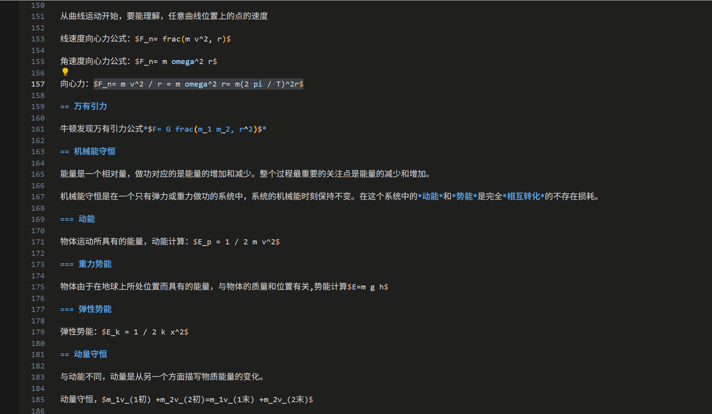

# typstf

一个用于将 Typst 数学公式导出为 SVG 格式，以及将 Typst 文档转换为 Markdown 的 VS Code 扩展。

## 功能特性

- **行内公式导出**：自动识别光标所在的 `$...$` 行内公式并导出为 SVG
- **选区导出**：支持选中任意公式文本后导出
- **自动命名**：使用公式内容的 SHA256 哈希值作为文件名，避免重复
- **Markdown 导出**：将 Typst 文档转换为 Markdown 格式
  - 支持标题转换
  - 支持公式转换为 LaTeX 格式
  - 支持粗体、斜体、链接、图片、列表转换
- **一键导出**：右键菜单即可快速导出，无需额外配置

## 使用方法

### 导出 SVG

1. 打开 `.typ` 文件
2. 将光标置于行内公式内，或选中要导出的公式文本
3. 右键选择 **TypstSvgExport**
4. SVG 文件将自动保存到工作区的 `typst-export` 目录

### 导出 Markdown

1. 打开 `.typ` 文件
2. 右键选择 **TypstToMarkdown**
3. Markdown 文件将生成在同一目录

## 演示

## 前置要求

- 系统需已安装 [Typst](https://github.com/typst/typst)
- VS Code 版本 ≥ 1.102.0

## 安装

在 VS Code 扩展市场搜索 `typstf` 并安装，或访问 [Visual Studio Marketplace](https://marketplace.visualstudio.com/items?itemName=msjy.typstf)。

## 已知问题

暂无

## 发布说明

### 0.0.6

- 新增 Markdown 导出功能
- 支持 Typst 到 Markdown 的完整转换
- 支持公式转换为 LaTeX 格式

### 0.0.5

- 初始发布
- 支持行内公式和选区公式导出为 SVG

## 许可证

MIT
